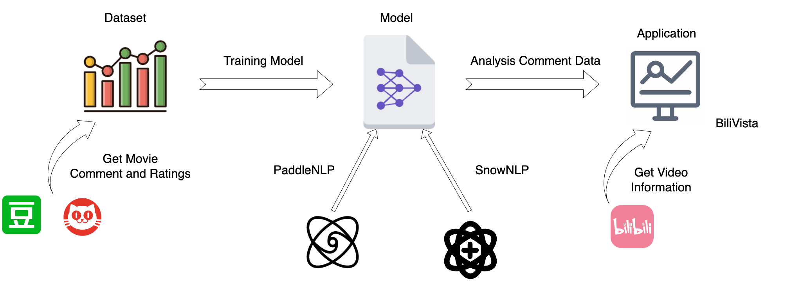
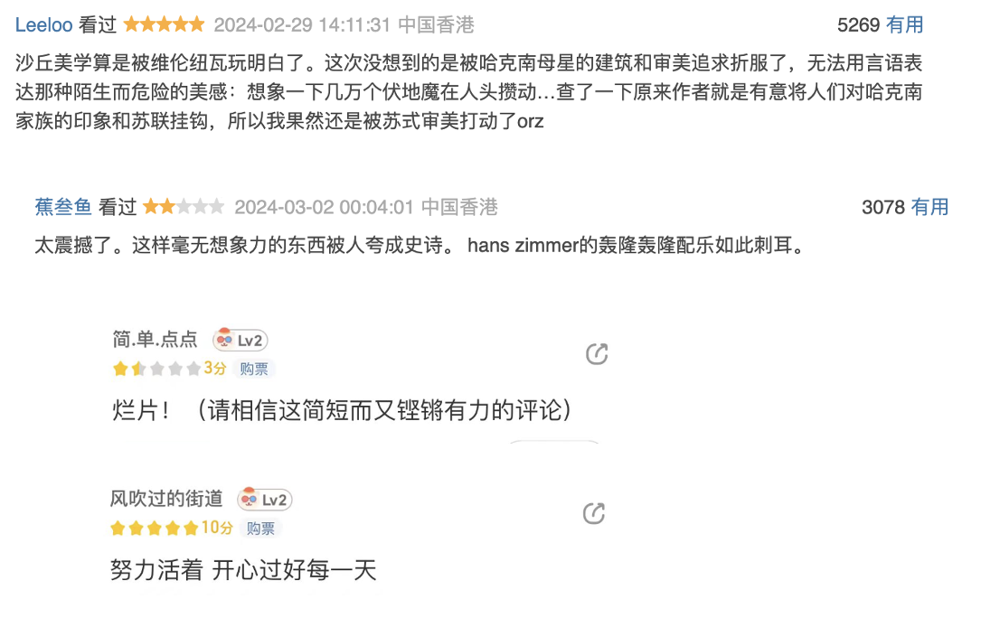
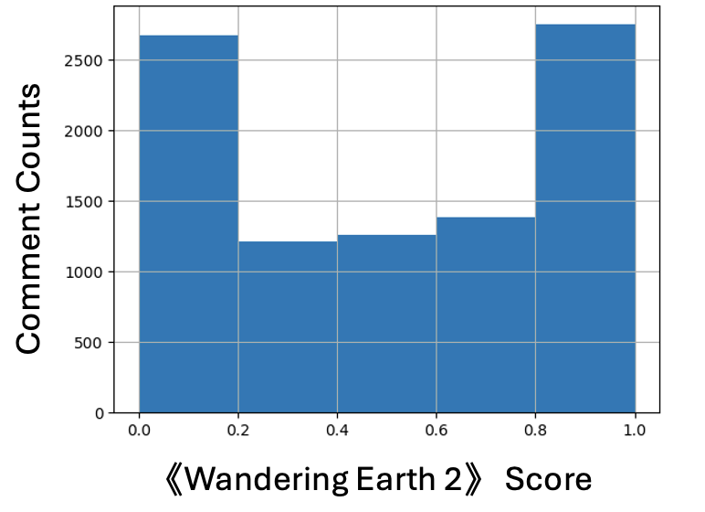
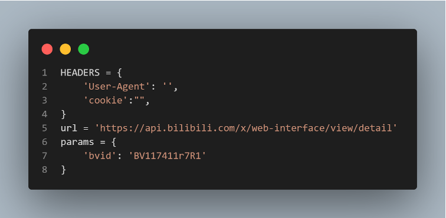
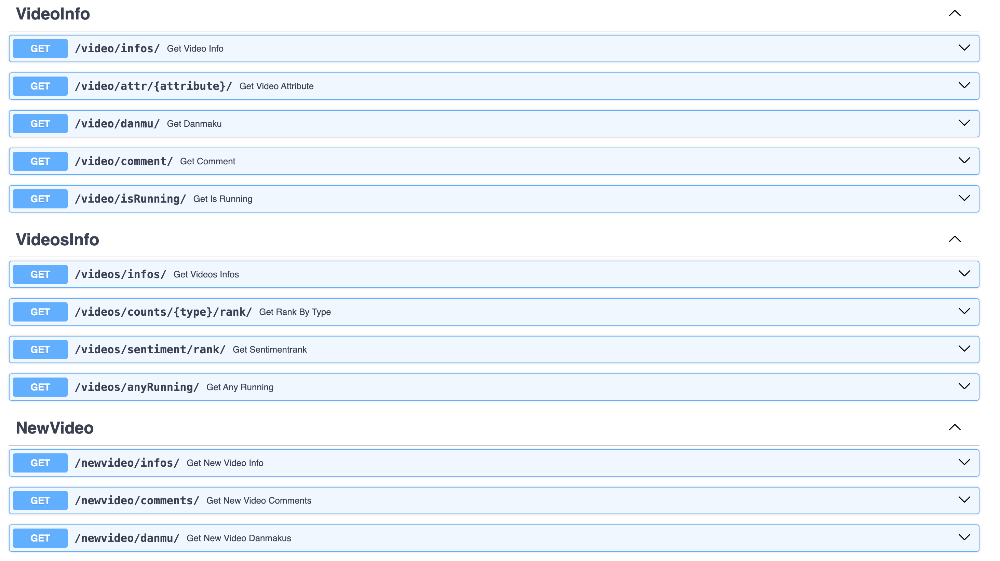

# Bilibili Vista

- Our codes are open source on github
[BilibiliVista](https://github.com/BiliVista)

## Quick Start

- For Backend

```shell
cd backend
python main.py
```

- For Frontend

```shell
cd frontend/code
npm i
npm run dev
```

## Overview

Firstly,We have implemented an automated movie review scraper to quickly obtain a large volume of movie reviews and ratings data. Based on this dataset (over 50,000 entries), we trained and implemented two favorability rate analysis models: one based on a favorability rate dictionary and Naive Bayes (machine learning), and another retrained on a transformer with whole word masking pre-training. Additionally, we developed a scraper capable of dynamically obtaining Bilibili video information (comments, bullet chats, etc.). Finally, we integrated these features using FastAPI to achieve front-end and back-end separation, supporting dynamic retrieval of Bilibili-related information and favorability rate analysis of comments on specified Bilibili videos using the two trained models, with dynamic data presentation to the front end.

## Core Features

1. **Automated Movie Review Scraper**:
   - Rapidly obtains a large volume of movie reviews and ratings data.

2. **favorability rate Analysis Models**:
   - **Model 1**: favorability rate dictionary combined with Naive Bayes (machine learning).
   - **Model 2**: Transformer-based model with whole word masking pre-training, retrained for favorability rate analysis.

3. **Dynamic Bilibili Video Information Scraper**:
   - Fetches detailed video information including comments and bullet chats dynamically.

4. **FastAPI-based Front-End and Back-End Integration**:
   - Supports dynamic retrieval of Bilibili-related information.
   - Facilitates dynamic favorability rate analysis of specified Bilibili video comments using the two trained models.
   - Provides real-time data presentation to the front end.

## Core Workflow



1. **Data Acquisition**
    - *Crawling Movie Comments*
        - `Douban`: Collect comments from the `Douban` movie site.
        - `Maoyan`: Collect comments from the `Maoyan` movie site.
    - *Data Cleaning*
        - Perform data cleaning to ensure the quality and consistency of the collected comments.

2. **Model Training**
    - *Machine Learning Model*
        - favorability rate dictionary combined with Naive Bayes (machine learning).
    - *Deep Learning Model*
        - Transformer-based model with whole word masking pre-training, retrained for favorability rate analysis.

3. **Model Application**
    - *Crawling Data from `Bilibili`*
        - Implement real-time data crawling from `Bilibili`, allowing users to input a video url and retrieve video information and comments instantly.
    - *Backend Development*
        - Develop the backend using the **FastAPI** Python framework to handle data processing and model integration.
    - *Frontend Development*
        - Implement a user-friendly interface to visualize and interact with the analysis results.

## Dataset

### ***Sources of Our Data***

- ***Douban***: A prominent movie site where users freely express their opinions on movies. These comments are often labeled by users' favorability rates, making them invaluable for our analysis.
- ***Maoyan***: Another key player in the movie industry with a rich database of user comments, similarly labeled, allowing for comparative studies and robust model training.

### ***Automated crawler to scrape movie reviews***

To quickly acquire a large dataset, we wrote an automated crawler for movie reviews to simplify the task. It can automatically scrape movie reviews and rating information from Douban and Maoyan.

Additionally, we have also open-sourced this crawler on [GitHub](https://github.com/open17/movie-comment-spider).

### ***Why These Datasets?***

- ***Labeled Data***: We chose to focus on comments from *Douban* and *Maoyan* because they offer labeled datasets. This is critical as labeled data provides a foundation for training and evaluating our favorability rate analysis models with higher accuracy.



## Model Training

### Model: Machine Learning

#### Model Introduction

- Here we use `favorability rate dictionary` combined with `Naive Bayes` which is based on SnowNLP.^[`SnowNLP` is a library focused on natural language processing tasks for Chinese text, such as favorability rate analysis and text processing.]
- According the dataset we gained from crawl data (**50000+ entries**), Randomly spilit the dataset into traning dataset and test dataset (8:2).

#### More Detail

##### Naive Bayes Algorithm

- *Assumes* that features are **independent** of each other.
- *Estimates* probabilities based on the features and labels in the training dataset.

$$T = \{(x_1, y_1), (x_2, y_2), \ldots, (x_N, y_N)\}$$
$$x_i = (x^1, \ldots, x^n)$$
$$y_i = c_k \quad and \quad k = 1 \ldots K$$
$$y = \arg\max_{c_k} P(y = c_k) \prod_{j} P(x^j | y = c_k)$$

##### Split characters

***Split Chinese characters*** and calculate the probability that the term appears in the set


### Model: Deep Learning

#### Model Introduction

- *Nowadays*,  studies have shown that `Pretrained Models` (PTM) based on large-scale unlabeled corpora can acquire generic language representations and perform well when fine-tuned to downstream tasks.
- Here we use Transformer-based model with whole word masking pre-training, retrained for favorability rate analysis which is based on Pre-training model `ERNIE` (Like Bert-wwm)
- According the dataset we gained from crawl data (**50000+ entries**), Randomly spilit the dataset into traning dataset, dev dataset(Used to dynamically adjust hyperparameters) and test dataset.

#### More Details

1. ***Remove*** a batch data from the `dataloader`
2. ***Feed batch data*** to the model for `forward calculation`
3. ***Pass forward*** calculation result to loss function to calculate loss. The forward calculation result is passed to the evaluation method, and the evaluation index is calculated.
4. ***Loss reverse*** return and update gradient. Repeat the above steps.

**Each time an epoch is trained, the program will evaluate the effectiveness of the current model training.**

### Model Evaluation

#### Test Accuracy

|Method|Test Dataset Accuracy|
|---|---|
|SnowNLP|78.58%|
|PaddleNLP|85.31%|

#### Generalizability Test

In order to test the generalizability of our model. We crawl the comment of the movie *《Wandering Earth 2》* From  the `Bilibili`, and analyze it with two models respectively.

1. ***Estimation the comment score***

- Machine Learning: Average comment favorability rate score is only ***0.54***. (Calculate method In the appendix)
- Deep Learning: Average comment favorability rate score is ***0.89***. (Calculate method In the appendix)

2. ***Favorability rate Score Distribution***

- Machine Learning Comment Score Distribution:

The distribution is polarized
- Deep Learning Comment Score Distribution:


**Obviously, the deep learning approach is more convincing, and the machine learning approach runs much faster than the deep learning approach.**

## BiliVista

### Bilibili information Crawler

#### Crawler Introduction

A crawler capable of dynamically obtaining Bilibili video information (comments, bullet chats, etc.) which will be used in the backend part.

#### Crawler Details

1. ***Set the User-Agent and cookie information***

Through `bvid` access to the comment information of the video including:

- Comment
- Number of comments and likes



2. ***Crawl video basic information***

Through `bvid` access to the basic information of the video including:

- Title
- Author
- Reply count, Favorite count,
- Coin count, Share count


3. ***Crawl video comment content and `danmu` content***

Through `bvid` request screen XML file obtained through basic information:

- Time
- Timestamp
- `Danmu` text


### Backend

#### Backend Introduction

Those features talking about above will be used in backend according to `FastAPI` (backend framwork) to achieve front-end and back-end separation, supporting dynamic retrieval of Bilibili-related information and favorability rate analysis of comments on specified Bilibili videos using the two trained models, with dynamic data presentation to the front end.

#### Backend Details

***Why FastAPI?***

*“FastAPI is a modern, fast (high-performance) web framework for building APIs with Python 3.6+.”*

- High performance
- Rapid development
- Automatic interactive API documentation
- Type hints for fewer bugs



***Introduction to the three main API categories: `video`, `videos`, `newvideo`***

- Usage of 3 APIs:
  - **video**: Fetch specific video information.
  - **videos**: Gather statistics on all scraped videos.
  - **newvideo**: Add new video data to the system.

### Frontend

In this part, we use `Vue3 + Typescripts + Arco Design + Vue-18n + Vite` and connect the python backend to visualize data.


### Visualization details

#### Favoriate-Like-Coin Rate

- Backend


- Frontend


#### Popular Rank

- Backend


- Frontend


#### Video infos

- Backend


- Frontend


#### Video Comments

- Backend


- Frontend


### Part of backend code


